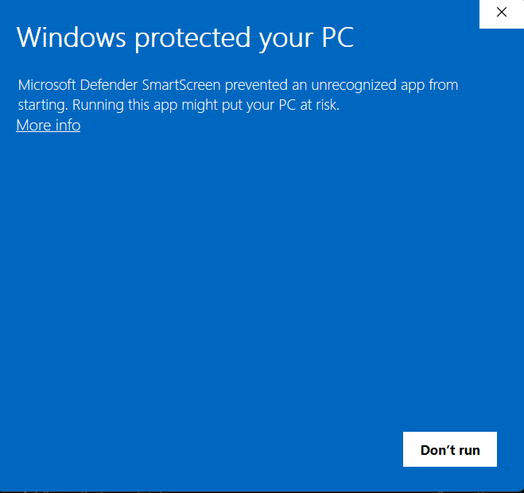
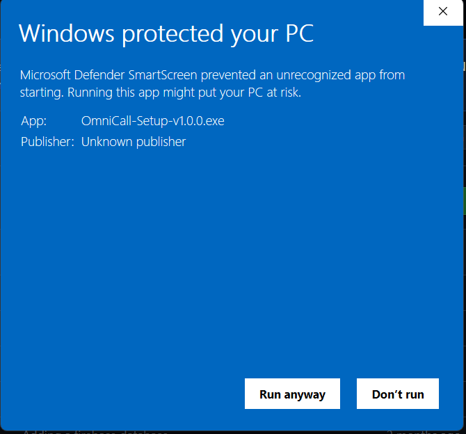
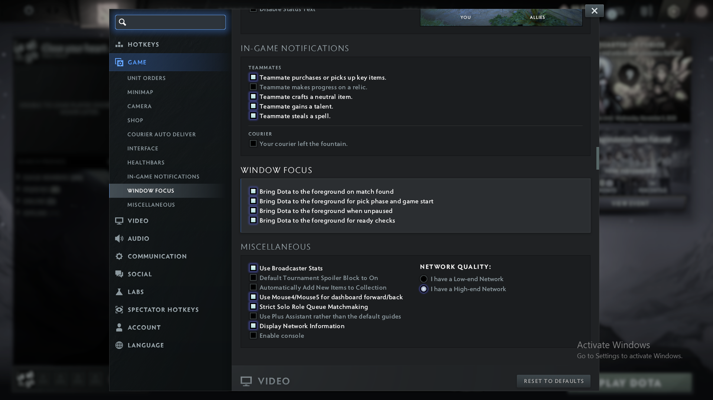

# 🎮 OmniCall - Game Match Notifier

> **Never miss a match again!** Get instant push notifications on your phone when a Dota 2 match is found.

OmniCall monitors your PC screen for game matches and sends instant notifications to your phone via a Progressive Web App (PWA). Perfect for gamers who multitask while waiting in queue!

---

## ✨ Features

- 🔔 **Instant Push Notifications** - Get alerted on your phone the moment a match is found.
- 🖥️ **Desktop Monitoring** - Runs quietly in the background on Windows.
- 📱 **Progressive Web App** - No mobile app installation required  just add the app to the home screen using the steps you will see below !
- 🔒 **Secure** - No data is stored from your side , you use an anonymous name to generate a token that is used to send ntofications to your device.
- ⚡ **Fast** - Optimized for low latency notifications.
- 📊 **Statistics** - Track your matches and see community stats.

---

## 🚀 Quick Start

### Prerequisites

- **Windows 10/11** (64-bit)
- **Python 3.11+** (if running from source)
- **Modern smartphone** with web browser
- **Internet connection**

---

## 📱 Setup Guide

### Step 1: Download and Install

1. **Go to [Releases](../../releases)** and download the latest `OmniCall-Setup-v1.0.0.exe`

2. **Windows SmartScreen Warning** - When you first run the installer, Windows will show a security warning:

   
   *Click "More info" to proceed*

   
   *Click "Run anyway" to start installation*

   > **Why this happens:** OmniCall is a standalone developed open-source app from me (the developer) without an expensive code signing certificate ($200+/year). Your PC is safe - this warning appears for all new unsigned apps.

3. **Run the installer** - After bypassing the warning, you'll see the installation screens:

   
   *License agreement - Read and accept to proceed*

   
   *Select additional tasks (Desktop shortcut, etc.)*

   
   *Press install*

   
   *Wait for the installer to finish*

   
   *Installation complete - Launch OmniCall*

---

### Step 2: Register Your Device

1. **Launch OmniCall** - You'll see the registration screen:

   
   *Enter a friendly device name (e.g., "Nevermore's Laptop", "Gaming PC")*

2. **Generate Pairing QR** - After entering your name, click the button:

   
   *Click "Generate Pairing QR" to create your unique pairing code*

---

### Step 3: Pair Your Phone

1. **Scan the QR Code** - The setup screen appears with QR and instructions:

   
   *Scan this QR code with your phone camera*

2. **Install PWA on Your Phone** - Watch this quick setup guide:

   <div align="center">
   
   
   https://github.com/user-attachments/assets/1ad8c082-f9be-478e-81c7-4422e4079dc6
   
   *📱 1-minute video showing iPhone and Android PWA installation*
   
   </div>

   **Or follow these steps manually:**

   **For iPhone:**
   - Scan QR → Opens in Safari
   - Tap Share button (⬆️) → "Add to Home Screen"
   - Tap "Add" → Open from home screen
   - Tap "Enable Notifications" in the PWA

   **For Android:**
   - Scan QR → Opens in Chrome
   - Tap menu (⋮) → "Install app"
   - Tap "Install" → Open from home screen
   - Tap "Enable Notifications" in the PWA

3. **Send Test Notification** - Back on your PC, click "Send Test Notification":

   
   *✅ Confirmation screen - Your phone is now paired!*

---

### Step 4: Configure Dota 2 Settings (Critical!)

**Important:** For OmniCall to detect matches, Dota 2 must bring itself to the foreground when a match is found.



**Steps:**
1. Open **Dota 2**
2. Go to **Settings** (⚙️ icon)
3. Navigate to the **"Window Focus"** tab
4. **Enable** the checkbox: **"Bring Dota to the foreground when match found"**d

> **Why this is critical:** OmniCall monitors your screen for the match acceptance popup. If Dota doesn't come to the foreground, the app won't be able to detect the match and send you a notification.

---

### Step 5: You're Ready!

Your desktop app and phone are now connected. You'll receive instant notifications when matches are found and the app is running in the background.

---

## 🎯 How to Use

### Starting Game Tracking

1. Launch **OmniCall** on your PC
2. Go to the **"Tracking"** tab
3. Click the **toggle button** to turn tracking **ON** (green)
4. Minimize the app and play your game

### What Happens Next

- OmniCall monitors your screen to captrhe the Accept button.
- When a match is detected, it sends a notification to your phone
- You'll get a push notification instantly
- Click the notification to see details

### Stopping Tracking

- Click the toggle button again to turn it **OFF** (red)
- Or simply close the app

---

## 📊 App Features

### 🎮 Tracking Tab - Initial State


When you first launch OmniCall, tracking is **OFF** (red button):
- **Complete registration** - Ensure you've paired your phone first
- **Send Test** - Verify notifications work before starting tracking
- **Show Pairing QR** - Add more phones or re-pair if needed
- **Status indicator** - Shows "Tracking idle" when not monitoring

*Ready to start? Click the toggle button to turn tracking ON!*

---

### 🎮 Tracking Tab - Active Monitoring


Once you enable tracking, the button turns **ON** (green):
- **Real-time status** - Shows "Detector running" or "Match detected!"
- **Instant notifications** - Phone alerts you the moment a match is found

*Keep this running in the background while you queue for games!*

---

### 📈 Statistics Tab


View your gaming activity and community stats:

**Your Activity:**
- **Games Found** - Total matches detected on your PC
- **Last Match** - Timestamp of your most recent match

**Community Stats:**
- **Total Users** - Active OmniCall users worldwide
- **Total Matches** - All matches found by the community
- **Total Notifications Sent** - Cumulative notifications delivered

*Click "Refresh" to update stats in real-time*

---

### 💬 Feedback Tab


Share your thoughts directly with the developer:
- **Feedback text area** - Report bugs, suggest features, or share your wins
- **Word counter** - Track your message length (max 2000 words)
- **Submit button** - Send feedback instantly to the creator

---

### 🛠️ Support Tab


Support the project and keep development going if you wish !!


---

##  For Developers

### Tech Stack

**Desktop App:**
- Python 3.11+
- PyQt6 (GUI)
- OpenCV (screen detection)
- Requests (HTTP client)

**Backend:**
- Firebase Cloud Functions (Node.js)
- Firestore (database)
- Firebase Cloud Messaging (notifications)

**Mobile:**
- Progressive Web App (PWA)
- Service Workers (background notifications)

### Building from Source

1. **Install dependencies**
   ```bash
   pip install -r pc_app/requirements.txt
   ```

2. **Build with PyInstaller**
   ```bash
   pyinstaller OmniCall.spec
   ```

3. **Output** will be in `dist/OmniCall/`

### Running Tests

```bash
# Test notification sending
python pc_app/omnicall_app.py

# Check logs
firebase functions:log
```

---

##  Privacy & Security

-  **No personal data** collected beyond device pairing and statiscts shown in the app itself. 
-  **Open source** - review the code yourself

**What we store:**
- Device ID (random, anonymous)
- Display name (you choose)
- FCM tokens (for notifications)
- Match statistics (count only)

---

##  License

This project is licensed under the **MIT License** - see [LICENSE](LICENSE) file for details.

---

##  Contributing

Contributions are welcome! Please:

1. Fork the repository
2. Create a feature branch (`git checkout -b feature/amazing-feature`)
3. Commit your changes (`git commit -m 'Add amazing feature'`)
4. Push to the branch (`git push origin feature/amazing-feature`)
5. Open a Pull Request

---

##  Contact & Support

- **GitHub Issues**: [Report bugs or request features](../../issues)
- **Email**: amrkhaled122@aucegypt.edu
- **Website**: [https://amrkhaled122.github.io/OmniCall/](https://amrkhaled122.github.io/OmniCall/)

## ⚠️ Disclaimer

This tool is for **personal use only**. Use responsibly and in accordance with the Terms of Service of any games you play. The developer is not responsible for any consequences of using this software.

---
*Star ⭐ this repo if you find it useful!*
